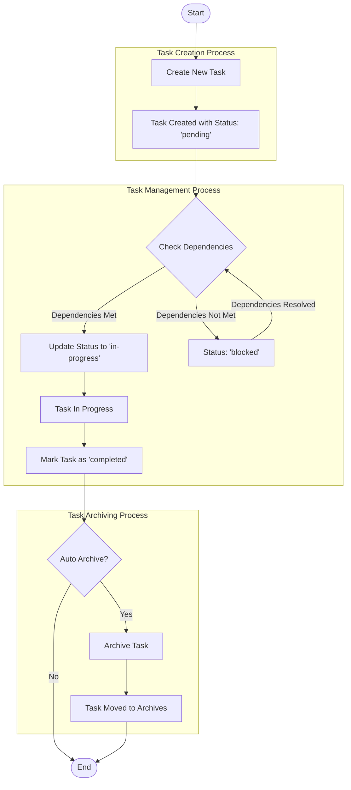
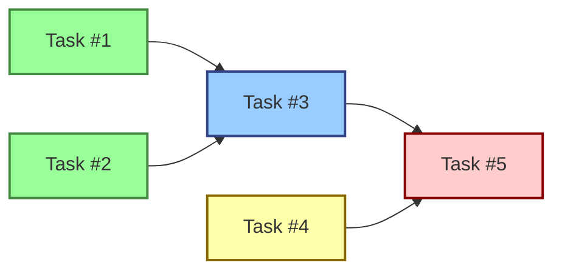

# Task Management Workflow



## Process Details

### Task Creation Process
1. A new task is created with required properties (title, description)
2. System assigns auto-incrementing ID and default values
3. Task is saved with initial status 'pending'

### Task Management Process
1. When user wants to start working on a task, dependencies are checked
2. If all dependencies are completed, status can be changed to 'in-progress'
3. If dependencies are not met, task remains 'pending' or can be marked 'blocked'
4. When work is complete, task is marked as 'completed'

### Task Archiving Process
1. Completed tasks can be archived manually or automatically (daily check)
2. Archived tasks are moved from active tasks to archives folder
3. Archived tasks retain all their properties plus archiving metadata
4. Archived tasks can be restored if needed

## State Transitions

```mermaid
stateDiagram-v2
    [*] --> pending
    pending --> in-progress: Dependencies Met
    pending --> blocked: Dependencies Not Met
    blocked --> pending: Dependencies Changed
    blocked --> in-progress: Dependencies Met
    in-progress --> completed: Work Finished
    in-progress --> blocked: New Dependency Added
    completed --> pending: Reopened
    completed --> archived: Archiving Process
    archived --> pending: Restore Process
```

## Task Dependency Management



## Integration with Indicab Website

The task management system integrates with the indicab-Website project through the following connections:

1. **User Authentication**: Task assignments use the same user system as the main application
2. **Admin Dashboard**: Task management features appear in the admin dashboard for project management
3. **Booking System**: Tasks can be linked to specific bookings for issue tracking
4. **Driver Management**: Tasks can be assigned to drivers through the existing driver management system 